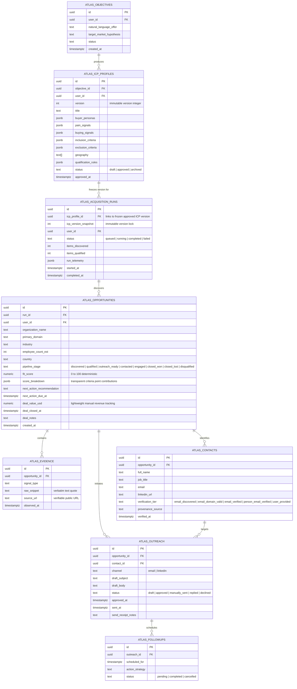
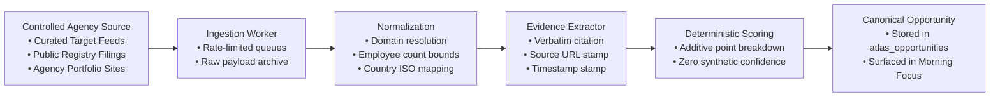
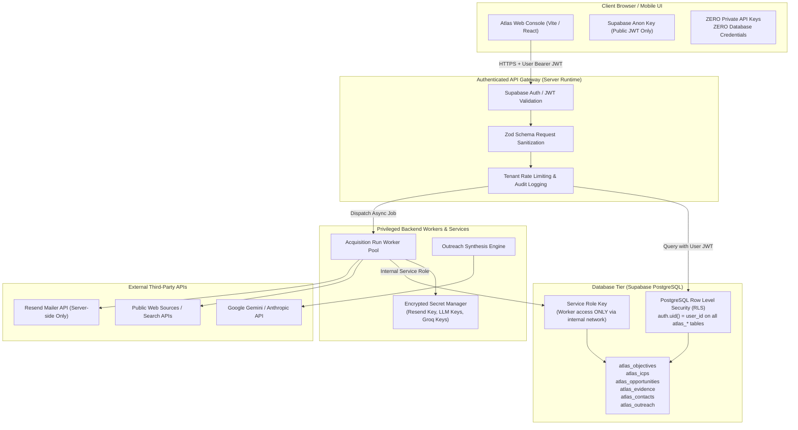
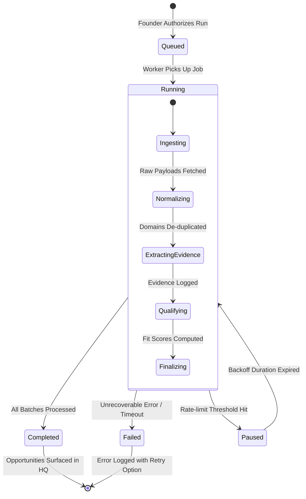
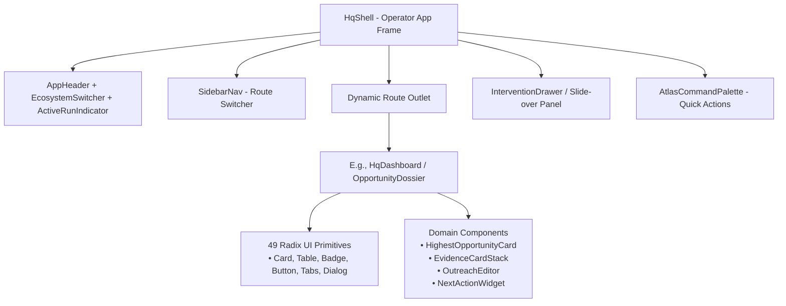
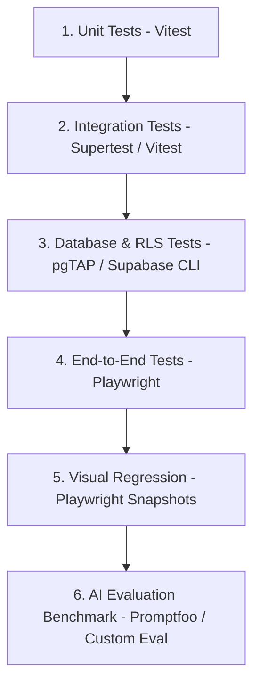

# PSEUDONYMS — PHASE 1 ARCHITECTURE REVIEW GATE & PRODUCT SPECIFICATION

> **Document Status:** PROPOSED FOR FOUNDER WORKSHOP REVIEW  
> **Ecosystem Component:** Atlas (The Economic Proving Ground)  
> **Core Thesis:** *Can one capable founder operate with the leverage of an elite cross-functional team?*  
> **Execution Constraint:** STOP condition active — No feature coding, legacy table drops, or git history rewrites until approved.

---

## 0. CREDENTIAL SECURITY QUARANTINE & INCIDENT REMEDIATION

Before proceeding with Atlas feature development, the critical credential exposure identified during the repository audit must be isolated, inventoried, and placed under a rigorous revocation and rotation protocol.

### 0.1 Inventory of Exposed Credentials (Values Redacted)

The following credentials have been identified on local disk across the monorepo workspace. In strict compliance with security protocols, **no secret values are printed below**.

| Location / File | Variable Name | Owning Provider | Exposure Tier | Risk Level |
| :--- | :--- | :--- | :--- | :--- |
| `Atlas io/.env` | `RESEND_API_KEY` | Resend | Server / Developer Disk | **CRITICAL** |
| `Atlas io/.env` | `VITE_RESEND_API_KEY` | Resend | **Client Bundle (Vite)** | **CRITICAL** (Exposed in client JS) |
| `Metaphor/backend/.env` | `DATABASE_URL` | Supabase (`sqthvliapkauoxieiwfb`) | Backend / Database Pooler | **CRITICAL** (Direct DB pass) |
| `Metaphor/backend/.env` | `GEMINI_API_KEY` | Google AI Studio | Backend / Local Disk | HIGH |
| `Metaphor/backend/.env` | `ENCRYPTION_KEY` | Internal Metaphor Engine | Backend / Local Disk | HIGH |
| `Metaphor/backend/.env` | `GITHUB_CLIENT_SECRET` | GitHub OAuth App | Backend / OAuth Application | HIGH |
| `Metaphor/backend/.env` | `NOTION_CLIENT_SECRET` | Notion Integration App | Backend / OAuth Application | HIGH |
| `Metaphor/backend/.env` | `LINEAR_CLIENT_SECRET` | Linear OAuth App | Backend / OAuth Application | HIGH |
| `Orion/apps/server/.env` | `SUPABASE_SERVICE_ROLE_KEY`| Supabase (`imguadokkmkckvukkmjg`) | Server-only (Bypasses RLS)| **CRITICAL** |
| `Orion/apps/web-v2/.env.local`| `SUPABASE_SERVICE_ROLE_KEY`| Supabase (`imguadokkmkckvukkmjg`) | Server-only (Bypasses RLS)| **CRITICAL** |
| `Orion/apps/web-v2/.env.local`| `GEMINI_API_KEY` | Google AI Studio | Backend / Local Disk | HIGH |
| `Orion/apps/web-v2/.env.local`| `GROQ_API_KEY` | Groq Cloud | Backend / Local Disk | HIGH |
| `Orion/apps/mobile/.env` | `EXPO_PUBLIC_OPENROUTER_API_KEY`| OpenRouter | **Client Bundle (Expo)** | **CRITICAL** (Exposed in mobile app) |
| `Clario/.env` | `VITE_GEMINI_API_KEY` | Google AI Studio | **Client Bundle (Vite)** | **CRITICAL** (Exposed in client JS) |
| `Atlas io/chrome-extension/popup.js`| Hardcoded Anon JWT | Supabase (`sqthvliapkauoxieiwfb`) | Client (Committed in git) | MEDIUM (Public anon key) |

### 0.2 Git History Footprint Confirmation

A full commit log traversal (`git log --all --name-only -- "**.env*"`) was executed across the root monorepo, `Atlas io`, `Metaphor`, `Orion`, and `PseudonymsID`.

* **Result:** **No `.env` or `.env.local` files containing actual secrets were ever committed to git history.** Only `.env.example` templates were tracked.
* **Tracked Leaks:** The public Supabase anon key was committed directly into `Atlas io/chrome-extension/popup.js`.
* **Client-side Bundling Risk:** `VITE_RESEND_API_KEY`, `VITE_GEMINI_API_KEY`, and `EXPO_PUBLIC_OPENROUTER_API_KEY` are read by client source code (`campaignEngine.ts`, `gemini.ts`, mobile services). Any production build would bake these private credentials into public JavaScript bundles.

### 0.3 Git Protection Implemented

The following ignore guards have been updated in `.gitignore` files:
1. Root `.gitignore`: Strengthened with wildcard recursion (`**/.env`, `**/.env.*`, `**/.env*.local`, `*.pem`, `*.key`, `*service-account*.json`, `credentials.json`).
2. `Clario/.gitignore`: Added explicit `.env`, `.env.*`, and `.pem` ignore rules.
3. `Weave/.gitignore`: Created new `.gitignore` file with complete environment and certificate guards.

### 0.4 Founder Rotation & Revocation Protocol

The founder should execute the following credential rotation checklist in provider consoles prior to live customer acquisition:

- [ ] **Resend**: Log into [resend.com](https://resend.com) -> API Keys -> Revoke key starting with `re_9...` -> Generate new key -> Store ONLY in server environment, remove all `VITE_RESEND_API_KEY` declarations.
- [ ] **Supabase (`sqthvliapkauoxieiwfb`)**: Log into Supabase Dashboard -> Project Settings -> Database -> Reset database password (invalidates the exposed `DATABASE_URL` pooler string).
- [ ] **Supabase (`imguadokkmkckvukkmjg`)**: Log into Supabase Dashboard -> API Settings -> Roll Service Role Secret Key (invalidates exposed service role JWTs).
- [ ] **Google AI Studio**: Log into [aistudio.google.com](https://aistudio.google.com) -> API Keys -> Delete key starting with `AQ.A...` -> Create new key -> Restrict to server backend endpoints.
- [ ] **OpenRouter**: Log into OpenRouter dashboard -> Revoke key starting with `sk-o...` -> Generate new key -> Route requests through Orion backend server rather than mobile client.
- [ ] **Groq**: Log into Groq console -> Revoke key starting with `gsk_...` -> Generate new key for server runtime.
- [ ] **GitHub / Notion / Linear OAuth**: Roll client secrets in respective developer portals.
- [ ] **Local `.env` Hygiene**: Populate local `.env` files from a secure password manager; never stage or commit replacement secrets.

---

## SECTION A: PRODUCT FLOW DIAGRAM

Atlas is the economic engine of Pseudonyms. Its purpose is to guide a solo founder from initial strategic intent or ICP definition to verified revenue, while enforcing human judgment at all high-consequence transition points.

```mermaid
flowchart TD
    subgraph ENTRY ["Atlas Entry Modes"]
        E1["Mode 1: Natural Language Objective\n('Sell AI automation to 5-30 person agencies')"]
        E2["Mode 2: Pre-defined ICP\n('5-30 person web agencies in US/UK')"]
    end

    subgraph PROPOSAL ["ICP Synthesis & Approval"]
        A1["AI ICP Synthesis Engine\n(Extracts buyers, pain signals, buying signals, filters)"]
        G1{{"FOUNDER CHECKPOINT 1\nInspect, Edit & Approve ICP"}}
    end

    subgraph CAMPAIGN ["Campaign Orchestration"]
        C1["Campaign Configuration\n(Cadence, source selection, run limits)"]
        G2{{"FOUNDER CHECKPOINT 2\nAuthorize Acquisition Run"}}
    end

    subgraph DISCOVERY ["Discovery & Ingestion"]
        D1["Verified External Data Sources\n(Web, registries, job boards, public listings)"]
        D2["Normalization & Entity Resolution\n(Domain deduplication, company canonicalization)"]
        D3["Evidence Extraction\n(Raw verbatim quotes, timestamps, source URLs)"]
    end

    subgraph QUALIFICATION ["Qualification Engine"]
        Q1["Rule-Based Criteria Matcher\n(Evaluates inclusion/exclusion constraints)"]
        Q2["Evidence-Grounded Fit Scoring\n(Zero synthetic scores; provenance required)"]
        G3{{"FOUNDER CHECKPOINT 3\nOpportunity Review & Ranking"}}
    end

    subgraph OUTREACH ["Outreach Studio (V1 Human-in-the-Loop)"]
        O1["Contextual Copy Generator\n(Grounds pitch in observed evidence)"]
        G4{{"FOUNDER CHECKPOINT 4\nInspect, Edit & Approve Draft Copy"}}
        O2["Founder Manual Send\n(Email client / LinkedIn manual send)"]
        O3["Audit Logging & Sent State Transition"]
    end

    subgraph REVENUE ["Follow-Up & Revenue Pipeline"]
        F1["Next Best Action Engine\n('Follow up in 3 days with case study')"]
        F2["Response Handling & Engagement Tracking"]
        R1["Deal Progression & Revenue Verification\n(Invoice issued, contract signed, cash collected)"]
    end

    E1 --> A1
    A1 --> G1
    E2 --> G1
    G1 -->|Approved| C1
    G1 -->|Rejected / Edit| A1
    C1 --> G2
    G2 -->|Authorized| D1
    D1 --> D2
    D2 --> D3
    D3 --> Q1
    Q1 --> Q2
    Q2 --> G3
    G3 -->|Promoted| O1
    G3 -->|Disqualified| D2
    O1 --> G4
    G4 -->|Approved| O2
    G4 -->|Edit Request| O1
    O2 --> O3
    O3 --> F1
    F1 --> F2
    F2 --> R1
```



### Detailed Operator Step Descriptions

1. **Objective Mode Entry**: The founder inputs natural-language business intent (e.g., "I want to sell AI operations automation to 5–30 person digital agencies").
2. **ICP Synthesis**: Atlas analyzes the offer and proposes a structured ICP: target buyer titles, high-intent pain signals, buying signals, inclusion rules, negative exclusion rules, and geographic constraints.
3. **ICP Mode Entry**: The founder bypasses synthesis and inputs explicit search criteria directly.
4. **Founder Checkpoint 1 (ICP Approval)**: The founder reviews every criteria field, adjusts thresholds, adds negative exclusions, and approves.
5. **Campaign Configuration & Checkpoint 2**: The founder configures source parameters and authorizes an acquisition run.
6. **Discovery & Normalization**: The runner queries real data sources, normalizes domains, and deduplicates existing records.
7. **Evidence Extraction**: Every signal must be captured with source URL, raw snippet, and timestamp.
8. **Qualification & Checkpoint 3**: Rules filter companies into Qualified Opportunities. The founder inspects the ranked list and evidence dossiers.
9. **Outreach Drafting & Checkpoint 4**: Atlas synthesizes a hyper-personalized draft citing real evidence. The founder edits, refines, and signs off.
10. **Manual Send**: The founder clicks to copy/open their native email or LinkedIn client to transmit the message. No autonomous mass blast.
11. **Follow-Up & Next Best Action**: Atlas logs the communication, computes the next best action, and sets due-date reminders.
12. **Revenue Conversion**: When an engagement closes, the deal value, currency, and contract provenance are recorded.

---

## SECTION B: DOMAIN MODEL

Atlas transitions from an untyped single-table model (`pipeline_crm` / `kuro_pipeline_view`) to a normalized, relational domain schema with strict foreign keys, audit trails, and provenance links.



### Entity Lifecycles & State Transitions

1. **`atlas_icp_profiles`**: `draft` → `in_review` → `approved` → `archived`.
2. **`atlas_acquisition_runs`**: `queued` → `running` → `completed` | `failed` | `aborted`.
3. **`atlas_opportunities`**: `discovered` → `qualified` → `outreach_ready` → `contacted` → `engaged` → `deal_won` | `deal_lost` | `disqualified`.
4. **`atlas_outreach`**: `draft` → `in_review` → `approved` → `manually_sent` → `replied` | `declined`.
5. **`atlas_contacts`**: `discovered` → `email_verified` | `verification_failed` | `manual_override`.

---

## SECTION C: API SURFACE

All Atlas operations are exposed as strictly typed RPC or REST endpoints governed by Zod schemas, enforcing tenant isolation via Supabase Auth `user_id`.

### 1. Objective & ICP Endpoints

#### `POST /api/v1/atlas/objectives/propose-icp`
* **Purpose**: Generates a structured ICP proposal from an objective description.
* **Request Contract**:
  ```typescript
  export interface ProposeIcpRequest {
    objectiveText: string;
    offerDetails?: {
      pricingModel?: "fixed" | "retainer" | "value_share";
      pricePointUsd?: number;
      deliverableSummary?: string;
    };
    targetGeography?: string[];
  }
  ```
* **Response Contract**:
  ```typescript
  export interface ProposeIcpResponse {
    objectiveId: string;
    proposedIcp: {
      title: string;
      rationale: string;
      buyerPersonas: Array<{ role: string; seniority: string; corePain: string }>;
      painSignals: Array<{ signal: string; sourceHint: string; weight: number }>;
      buyingSignals: Array<{ signal: string; indicator: string; weight: number }>;
      inclusionCriteria: string[];
      exclusionCriteria: string[];
      suggestedGeography: string[];
      qualificationThreshold: number;
    };
  }
  ```

#### `POST /api/v1/atlas/icps/approve`
* **Purpose**: Saves the founder-edited and approved ICP profile.
* **Request Contract**:
  ```typescript
  export interface ApproveIcpRequest {
    objectiveId: string;
    icpProfile: {
      title: string;
      buyerPersonas: Array<{ role: string; seniority: string; corePain: string }>;
      painSignals: Array<{ signal: string; sourceHint: string; weight: number }>;
      buyingSignals: Array<{ signal: string; indicator: string; weight: number }>;
      inclusionCriteria: string[];
      exclusionCriteria: string[];
      geography: string[];
      qualificationRules: Record<string, unknown>;
    };
  }
  ```
* **Response Contract**: `{ icpId: string; status: "approved"; createdAt: string }`

### 2. Campaign & Run Endpoints

#### `POST /api/v1/atlas/campaigns`
* **Purpose**: Initializes a campaign linked to an approved ICP.
* **Request**: `{ icpId: string; name: string; sourceConnectors: string[]; limitCount: number }`
* **Response**: `{ campaignId: string; status: "configured" }`

#### `POST /api/v1/atlas/runs/dispatch`
* **Purpose**: Dispatches a background acquisition run. Requires founder authorization.
* **Request**: `{ campaignId: string; maxOrganizations: number; runMode: "real" | "fixture" }`
* **Response**: `{ runId: string; status: "queued"; estimatedDurationSeconds: number }`

#### `GET /api/v1/atlas/runs/:id/telemetry`
* **Purpose**: Server-Sent Events (SSE) live progress feed for the UI.
* **Stream Events**:
  ```typescript
  type RunStreamEvent =
    | { type: "heartbeat"; timestamp: string }
    | { type: "step_change"; step: "ingestion" | "normalization" | "evidence" | "qualification" }
    | { type: "item_discovered"; domain: string; companyName: string }
    | { type: "evidence_captured"; domain: string; signalType: string; snippet: string }
    | { type: "item_qualified"; opportunityId: string; fitScore: number }
    | { type: "run_complete"; summary: { discovered: number; qualified: number; errors: number } }
    | { type: "run_failed"; error: string };
  ```

### 3. Opportunities & Evidence Endpoints

#### `GET /api/v1/atlas/opportunities`
* **Query Params**: `stage`, `minScore`, `search`, `limit`, `offset`, `sortBy`
* **Response**:
  ```typescript
  export interface OpportunityListResponse {
    items: Array<{
      id: string;
      organizationName: string;
      primaryDomain: string;
      employeeCountEst: number | null;
      country: string | null;
      pipelineStage: string;
      fitScore: number;
      evidenceCount: number;
      primaryContact?: { name: string; title: string; email: string };
      nextAction?: { recommendation: string; dueAt: string };
    }>;
    total: number;
    hasMore: boolean;
  }
  ```

#### `GET /api/v1/atlas/opportunities/:id/dossier`
* **Purpose**: Retrieves full evidence trail and contact provenance for an opportunity.
* **Response**:
  ```typescript
  export interface OpportunityDossierResponse {
    opportunity: {
      id: string;
      name: string;
      domain: string;
      industry: string;
      employeeCount: number;
      fitScore: number;
      stage: string;
    };
    evidence: Array<{
      id: string;
      signalType: string;
      rawSnippet: string;
      sourceUrl: string;
      confidence: number;
      observedAt: string;
    }>;
    contacts: Array<{
      id: string;
      fullName: string;
      jobTitle: string;
      email: string;
      linkedinUrl?: string;
      verificationStatus: "verified" | "unverified" | "bounced";
      provenanceSource: string;
    }>;
    outreachHistory: Array<{
      id: string;
      channel: string;
      subject: string;
      body: string;
      status: string;
      sentAt?: string;
    }>;
  }
  ```

### 4. Outreach & Manual Send Endpoints

#### `POST /api/v1/atlas/outreach/draft`
* **Purpose**: Generates contextually grounded outreach copy using verified evidence.
* **Request**: `{ opportunityId: string; contactId: string; channel: "email" | "linkedin" }`
* **Response**: `{ outreachId: string; draftSubject: string; draftBody: string; evidenceCitations: string[] }`

#### `PATCH /api/v1/atlas/outreach/:id/approve`
* **Purpose**: Approves or updates edited copy.
* **Request**: `{ draftSubject: string; draftBody: string; notes?: string }`
* **Response**: `{ outreachId: string; status: "approved" }`

#### `POST /api/v1/atlas/outreach/:id/confirm-manual-send`
* **Purpose**: Records that the founder manually transmitted the outreach.
* **Request**: `{ transmittedAt: string; channel: "email" | "linkedin"; notes?: string }`
* **Response**: `{ outreachId: string; status: "manually_sent"; nextActionScheduled: string }`

---

## SECTION D: AGENT ARCHITECTURE & ICP PHILOSOPHY

### Core ICP Philosophy: "AI Proposes a Search Thesis. Founder Defines the Market."

An LLM can generate a persuasive ICP that is commercially incorrect. Atlas never treats AI output as discovered truth. Instead:
```text
Founder Objective
       ↓
AI Interpretation (Hypothesis Generator)
       ↓
Search Thesis / ICP Proposal (Draft)
       ↓
Founder Inspection & Edits
       ↓
APPROVED ICP (Version Locked)
       ↓
Immutable Version Snapshotted on Campaign / Run
```

Every acquisition run freezes the exact `icp_version` snapshot (e.g. `version: 1`). If the founder later modifies the employee range from 5–30 to 10–50, a new `version: 2` is created. Existing opportunities and historical runs retain permanent lineage to the exact criteria version that produced them.

### Execution Classification Matrix

| Workflow Step | Execution Mode | Agent / System Component | Failure Mode / Fallback |
| :--- | :--- | :--- | :--- |
| **1. Parse Natural Objective** | `AI-Assisted` | Gemini 1.5 Pro / Claude 3.5 Sonnet Structured Output | Strict JSON schema validation; retry on syntax error. |
| **2. ICP Review & Edit** | `Human-Approved` | Founder in Atlas ICP Workshop UI | Execution blocks until founder clicks "Approve ICP". |
| **3. Acquisition Run Launch**| `Human-Approved` | Founder Campaign Setup Screen | Run requires explicit founder dispatch. |
| **4. Ingestion / Fetching** | `Deterministic` | Node.js Worker / Controlled Target Connector | Exponential backoff on rate-limits; skip corrupt records. |
| **5. Domain Deduplication** | `Deterministic` | Canonical URL Normalizer (`psl` domain parsing) | Drop subdomains, match against existing `atlas_opportunities`. |
| **6. Evidence Signal Extraction**| `Deterministic` + `AI-Assisted` | Pattern matchers + contextual parser | Only snippets with verbatim quotes and public source URLs accepted. |
| **7. Transparent Scoring** | `Deterministic` | Direct criteria-point additive formula | Explainable breakdown; zero synthetic confidence factors. |
| **8. Opportunity Promotion** | `Human-Approved` | Founder Morning Focus Queue | Founder promotes top 3 daily opportunities to outreach. |
| **9. Outreach Copy Drafting** | `AI-Assisted` | Grounded Prompt citing `atlas_evidence` | LLM forbidden to invent facts; citations must exist in DB. |
| **10. Copy Inspection & Edit** | `Human-Approved` | Founder Outreach Drawer / Review Studio | Copy cannot be sent without human inspection and approval. |
| **11. Outreach Transmission** | `Deterministic` / Manual | Founder manual send (Copy to native mail/LinkedIn client) | Zero autonomous send daemons in V1. Sent marked manually. |
| **12. Next Action Scheduling** | `Deterministic` | Rules engine (+3 days for follow-up 1, +4 days for follow-up 2) | Stored as discrete action with calendar alert. |
| **13. Revenue Marking** | `Human-Approved` | Founder Deal Update | Manual deal value, currency, and invoice note. |

---

## SECTION E: DATA-SOURCE & SCORING ARCHITECTURE

Atlas V1 rejects unstructured scraping of startup directories (such as YC Directory or Hacker News). The first economic experiment focuses on a **controlled target market**:

> **Target Market**: 5–30 person digital, web, and marketing agencies in the US and UK with observable operational bottlenecks.



### Transparent Scoring Model (Explainable Without AI)

To eliminate ambiguous "confidence scores", Atlas V1 computes fit scores via a completely transparent, explainable point matrix totaling a maximum of 100 points:

```text
CRITERIA                         POINTS   VERIFICATION METHOD
-----------------------------------------------------------------------------------
Employee count fit (5–30 est)    +25      Public registry, LinkedIn range, team page
Geographic fit (US or UK)        +15      Registered address, domain TLD, contact page
Industry fit (Agency / Studio)   +15      Services offered, client case studies
Observed operational pain signal +20      Verbatim evidence from job post or team note
Observed buying signal           +15      Tech stack adoption, hiring for operations
Decision-maker identified        +10      Founder / Managing Director contact found
-----------------------------------------------------------------------------------
MAXIMUM FIT SCORE                100
```

Every opportunity card renders an immediate, explainable breakdown:
> **Fit Score: 85/100**  
> `+25` Employee range (12 detected)  
> `+15` United Kingdom (London registered)  
> `+15` Digital Agency (Web & branding services)  
> `+20` Pain signal: *"Struggling with project management overhead on retainer delivery"*  
> `+0` Buying signal: (None observed)  
> `+10` Decision maker: Sarah Jenkins (Managing Director)

### Contact Provenance Hierarchy (MX Check ≠ Contact Verification)

Atlas enforces a strict distinction between validating mail infrastructure and verifying person ownership:

1. `email_discovered`: Email string extracted from a public page or directory.
2. `email_domain_valid`: Domain MX DNS record verified active (proves domain receives mail; **does NOT prove the individual mailbox exists**).
3. `email_verified`: SMTP handshake (`RCPT TO`) accepted by mail server without bounce.
4. `person_email_verified`: Contact identity cross-referenced (e.g. author on company domain, verified press release).
5. `user_provided`: Founder manually entered or confirmed the email address.

**Hard Invariant**: An MX check is NEVER displayed as "contact verified".
   - Email addresses must have provenance (`scraped_contact_page`, `pattern_derived_mx_verified`, `user_provided`).
   - If MX verification fails, status is marked `unverified`; unverified contacts require manual founder override before outreach generation.

---

## SECTION F: SECURITY BOUNDARY

The architecture enforces strict separation between client-side user interfaces, authenticated backend endpoints, privileged operations, the database, and third-party APIs.



### Key Security Invariants

1. **Client Invariant**: The browser client receives ONLY the Supabase public anon key. It is architecturally prohibited from holding LLM API keys, mailer credentials, or database connection strings.
2. **Storage Invariant**: Third-party provider keys (Resend, Gemini, Groq) live exclusively in backend server environment variables or encrypted secrets vaults.
3. **Database RLS Invariant**: Every `atlas_*` table enforces `ALTER TABLE ... ENABLE ROW LEVEL SECURITY`. Default policy:
   ```sql
   CREATE POLICY "User isolation" ON public.atlas_opportunities
     FOR ALL USING (auth.uid() = user_id) WITH CHECK (auth.uid() = user_id);
   ```
4. **Manual Send Protection**: V1 code contains zero automated mailing daemons. All outbound mail execution requires authenticated user session dispatch from the backend.
5. **Schema Isolation Invariant (One Database ≠ One Schema)**:
   Shared infrastructure does NOT mean shared application tables. Atlas data lives strictly within `atlas_*` tables; Orion data lives within `orion_*` tables; shared identity is anchored exclusively at `auth.users`. No cross-app foreign keys or direct schema couplings are permitted.

---

## SECTION G: BACKGROUND WORKFLOW ARCHITECTURE

Acquisition runs operate asynchronously in the background. The user must be able to dispatch a run, navigate away, and observe live status updates or view historical completions.



### Run Lifecycle & UI Observation

1. **Job Dispatch**: The founder clicks "Launch Acquisition Run". A record is inserted into `atlas_acquisition_runs` with status `queued`.
2. **Worker Claim**: An async worker picks up the run, updates status to `running`, sets `started_at = now()`, and initializes a run heartbeat.
3. **Heartbeat & Telemetry**:
   - The worker periodically updates `run_telemetry` jsonb with counters: `{ discovered: 18, qualified: 7, errors: 0, currentStep: "qualifying" }`.
   - If no heartbeat is updated for 180 seconds, a watchdog job marks the run as `stalled` or resets it for retry.
4. **Live UI Observation**:
   - The Atlas UI subscribes to `GET /api/v1/atlas/runs/:id/telemetry` via Server-Sent Events (SSE).
   - Alternatively, Supabase Realtime channel `atlas_runs:run_id` broadcasts incremental updates.
   - The UI displays a live progress drawer: animated discovery counters, currently analyzed company domain, and newly qualified opportunities sliding in real time.
5. **Completion / Failure**:
   - On completion, `status = 'completed'`, `completed_at = now()`, and a notification event is pushed to `CrossAppBus`.

---

## SECTION H: MIGRATION PLAN

Atlas will transition smoothly from its prototype state (React memory, `localStorage`, `kuro_pipeline_view`, fake data) to the canonical `atlas_*` schema with zero downtime and no premature data loss.

### Phase 1: Dependency Inventory & Preservation Check

* **Legacy Database View**: `kuro_pipeline_view` is currently referenced across:
  - 12 Supabase Edge Functions (`sourcing-tool`, `crm-enrichment`, `agent-webhook`, `lead-scoring`, `outreach-orchestrator`, etc.).
  - 2 Atlas frontend views (`HqLeads.tsx`, `HqLeadDetail.tsx`).
* **Existing Assets to Retain**:
  - `packages/design-tokens`: Complete PDS-v5 token definitions.
  - `packages/ui`: `CrossAppBus`, `EcosystemSwitcher`.
  - `Atlas io/src/components/ui/*`: 49 Radix UI primitives.
  - `Atlas io/src/components/atlas/HqShell.tsx`: High-performance operator shell.
  - `Atlas io/src/components/atlas/PainEngine.tsx`, `OfferBuilder.tsx`: Core UI concepts for the ICP workshop.

### Phase 2: One-Way Compatibility Read Adapter Deployment

1. Apply migration `20260907000000_atlas_canonical_schema.sql` creating canonical `atlas_*` tables with RLS policies, foreign keys, and indexes.
2. Build a one-way read projection adapter for legacy consumers:
   ```text
                       ┌── New Atlas UI
                       │
   atlas_* canonical ──┼── New services
                       │
                       └── Legacy compatibility read adapter (view)
                                 ↓
                          old consumers (Edge Functions / views)
   ```
   ```sql
   -- Allows existing Edge Functions to continue reading while application transitions
   -- Read-only projection; legacy systems do NOT write back into atlas_*
   CREATE OR REPLACE VIEW public.legacy_kuro_sync AS
     SELECT 
       id,
       user_id,
       organization_name AS company_name,
       primary_domain AS domain,
       pipeline_stage AS status,
       fit_score AS score,
       created_at
     FROM public.atlas_opportunities;
   ```

### Phase 3: Historical Data Export, Mapping & Verification

1. Run export script: Extract all non-synthetic records from `pipeline_crm` / `kuro_pipeline_view` into an encrypted JSON backup (`docs/migration/legacy_crm_backup.json`).
2. Execute migration transform script:
   - Map `company_name` → `organization_name`
   - Map `domain` → `primary_domain`
   - Map `contact_email` → `atlas_contacts.email`
   - Map `lead_score` → `atlas_opportunities.fit_score`
   - Create initial `atlas_evidence` record documenting legacy origin.
3. Verification Checkpoint:
   - Query count check: Count legacy records vs migrated canonical records.
   - Foreign key integrity check: Ensure all contacts and opportunities have valid user ownership.

### Phase 4: Application Code Transition

1. **Eradicate `localStorage` business state**:
   - Remove `mockCompanies` initializers from `Index.tsx`, `HqDashboard.tsx`, and `usePipelineCRM.ts`.
   - Restrict `localStorage` strictly to user UI preferences (e.g. sidebar collapse state, density toggle).
2. **Replace React-only state with React Query**:
   - Implement `useAtlasOpportunities()`, `useAtlasIcp()`, `useAtlasRun()` backed by TanStack Query.
   - Cache invalidation on run events and manual updates.
3. **Eradicate Fake Generation & Scoring**:
   - Delete `generateMockLeads()`, `randomScoreGenerator()`, and synthetic fallbacks in `campaignEngine.ts`.
   - In dev mode, use an explicit mock connector that returns tagged `[DEV FIXTURE]` records so developers never mistake mocks for real business data.

### Phase 5: Edge Function Cutover & Legacy Deprecation

1. Update the 12 Supabase edge functions to query `atlas_opportunities` and `atlas_contacts`.
2. Add a PostgreSQL deprecation warning notice to `kuro_pipeline_view`.
3. Set `kuro_pipeline_view` to read-only mode (`REVOKE INSERT, UPDATE, DELETE ON public.pipeline_crm FROM authenticated, anon`).
4. **Final Checkpoint**: Only after explicit founder verification and 14 days of error-free operation on `atlas_*` will `kuro_pipeline_view` be dropped.

---

## SECTION I: FRONTEND ARCHITECTURE

Atlas frontend is an elite, high-density command console tailored for a solo founder. It enforces light-first PDS-v5 token ergonomics, responsive command layouts, and crisp data density.

### 1. Application Route Hierarchy

```
/                         -> HQ Command Center (Daily focus, Next Best Actions, active runs)
/objectives               -> Objective & Offer Studio (Natural language prompt to ICP proposal)
/icp                      -> ICP Profile Workshop (Inspect, edit, adjust weights, approve)
/campaigns                -> Campaign & Acquisition Run Manager (Sources, limits, run history)
/opportunities            -> Opportunity Pipeline (High-density tabular list, stage columns)
/opportunities/:id        -> Opportunity Dossier (Company overview, evidence timeline, contacts)
/outreach                 -> Outreach Review Studio (Queue of draft pitches, review/edit/approve)
/analytics                -> Economics & Revenue Telemetry (Conversion rates, deal values)
/settings                 -> Data Connectors & System Credentials
```

### 2. Component Composition & Reuse



### 3. Design Token & Ergonomics Binding

* All components bind directly to CSS custom properties defined in `@pseudonyms/design-tokens` (PDS-v5):
  - **Surfaces**: `var(--bg-canvas)`, `var(--bg-surface)`, `var(--bg-surface-elevated)`
  - **Text**: `var(--text-primary)`, `var(--text-secondary)`, `var(--text-muted)`
  - **Accents**: `var(--accent-atlas)` (Deep strategic navy / cobalt), `var(--status-success)`, `var(--status-warning)`
  - **Borders**: `var(--border-subtle)`, `var(--border-strong)`
* Dark/Light Mode: Default light-first operator theme with automatic dark-mode token mapping.

### 4. State Management Strategy

* **Server State**: Managed via **TanStack Query (React Query v5)**.
  - Automatic background refetching on window focus.
  - Optimistic updates for stage changes and manual send confirmations.
  - Granular cache keys: `['atlas', 'opportunities', { stage, filter }]`, `['atlas', 'runs', runId]`.
* **Transient Client State**: Managed via **Zustand**.
  - Active drawer state (`isEvidenceDrawerOpen`, `selectedOpportunityId`).
  - Active filter presets, column visibility, command palette open state.
  - Zero business entity data in Zustand or `localStorage`.

---

## SECTION J: TESTING ARCHITECTURE

To ensure high reliability, zero data leakage, and rigorous qualification accuracy, Atlas is covered by a multi-tiered automated testing suite.



### 1. Unit Tests (Vitest)
* **Scope**: Pure logic functions, validators, scoring formulas.
* **Target Files**:
  - `src/lib/scoring.test.ts`: Validates weighted qualification formula, ensures no synthetic scores, checks boundary conditions (0 to 100).
  - `src/lib/normalizers.test.ts`: Verifies domain cleanup, URL parsing with Public Suffix List, company name sanitization.
  - `src/lib/schemas.test.ts`: Validates Zod contracts for all API request/response payloads.

### 2. Integration Tests (Vitest + MSW)
* **Scope**: API route handlers, background worker state machines.
* **Scenarios**:
  - `POST /api/v1/atlas/objectives/propose-icp`: Simulates LLM response and verifies structured ICP format.
  - `POST /api/v1/atlas/runs/dispatch`: Confirms run transitions from `queued` to `running`.
  - Manual send workflow: Ensures marking an outreach as sent updates opportunity stage to `contacted` and schedules next action.

### 3. Database & RLS Tests (pgTAP / Supabase Local)
* **Scope**: Row Level Security verification, tenant isolation, cascade rules.
* **Scenarios**:
  - Test User A cannot read User B's opportunities, contacts, or evidence.
  - Test `anon` role has zero read/write access to any `atlas_*` tables.
  - Test deleting an opportunity cascades to `atlas_evidence` and `atlas_contacts`.

### 4. End-to-End Tests (Playwright)
* **Scope**: Full browser-driven operator journey.
* **Core Test Suite**:
  1. *Objective to ICP Flow*: Enter objective -> View proposed ICP -> Edit pain signal -> Click "Approve ICP" -> Verify campaign creation.
  2. *Opportunity Review Flow*: Open Opportunities table -> Click top ranked company -> Inspect Evidence Drawer -> Verify verbatim snippets and source URLs -> Promote to Outreach.
  3. *Outreach Approval & Manual Send Flow*: Generate pitch copy -> Edit subject line -> Click "Approve Draft" -> Click "Mark as Manually Sent" -> Confirm stage updates to `contacted` and next action appears.

### 5. Visual Regression Tests (Playwright Visual)
* **Scope**: Pixel-perfect layout fidelity on PDS-v5 components.
* **Targets**:
  - `HqShell` desktop layout (1440px) and tablet layout (1024px).
  - `HighestOpportunityCard` rendering with evidence badges.
  - `EvidenceDrawer` expanded state.

### 6. AI Evaluation Tests (Eval Harness)
* **Scope**: Grounding, accuracy, and non-hallucination of AI-generated assets.
* **Metrics**:
  - **Grounding Ratio**: % of claims in generated outreach copy that match an `atlas_evidence` record (Target: 100%).
  - **Criteria Adherence**: % of generated ICP buyer personas matching the founder's initial objective constraints (Target: > 95%).
  - **No Hallucinated Contacts**: Verify AI drafts never invent contact names or emails not present in `atlas_contacts`.

---

## SECTION K: STOP CONDITION & NEXT WORKSHOP STEP

### Review Gate Stop Checkpoint

In accordance with Phase 1 instructions:

1. **NO full rebuild code has been written.**
2. **NO legacy code or files have been deleted.**
3. **`kuro_pipeline_view` and `pipeline_crm` have NOT been dropped or altered.**
4. **Git history has NOT been rewritten.**
5. **No replacement secrets have been committed.**
6. **No automated mass outreach has been implemented.**

### Ready for Founder Workshop

The architecture specification above is submitted for product review. During the upcoming workshop, the founder will inspect and decide on:

1. Natural language objective prompt structure and ICP synthesis fields.
2. Initial real data sources to connect for the first economic experiment.
3. Outreach copy tone, structure, and manual transmission UX.
4. Final approval of the database migration schedule and credential rotation protocol.
